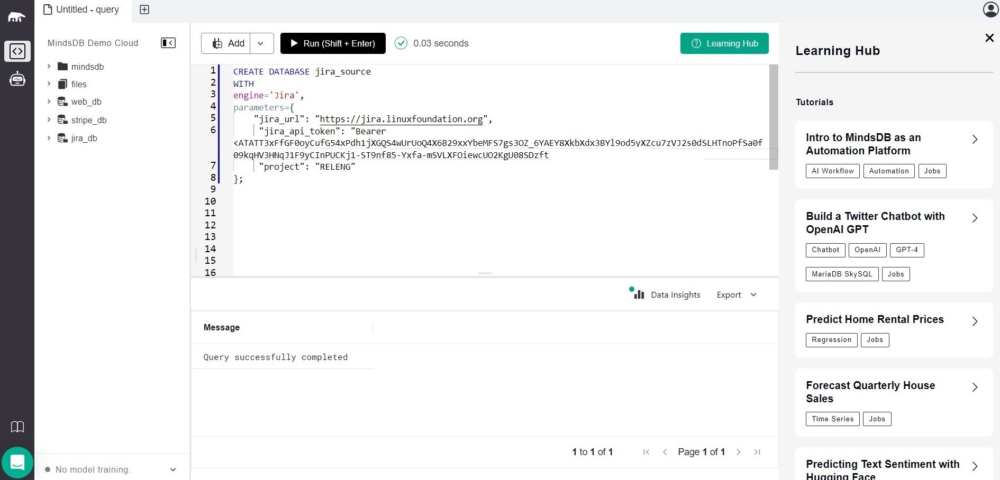
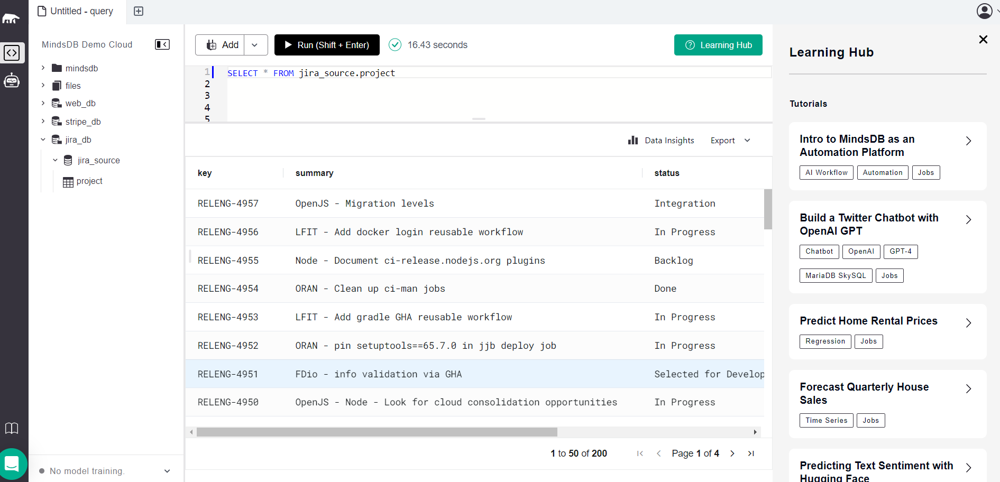
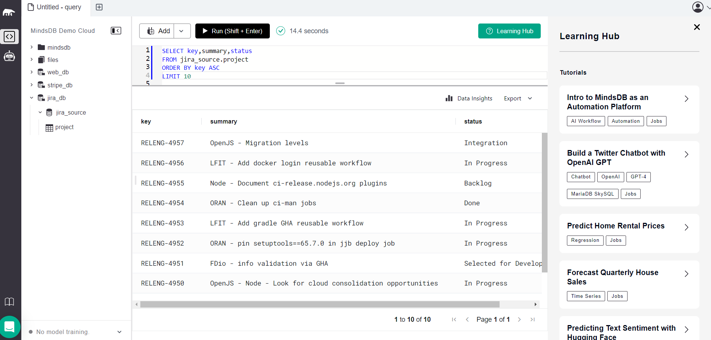

# Testing Jira App Integration

This README provides instructions for testing the Jira App integration in MindsDB.

For more details, refer to the related [GitHub Issue](https://github.com/mindsdb/mindsdb/issues/7852).

### 1. Create Database Using the following syntax In MindsDB 

**Description:**
### 1. This creates a database called jira_db. 

```
CREATE DATABASE jira_source
WITH
engine='Jira',
parameters={
    "jira_url": "https://jira.linuxfoundation.org",
     "jira_api_token": "Bearer <your-jira-api-token>",
     "project": "RELENG"   
};         

```
**Screeshot Result: Query successfull**



-----

### 2. we can use this established connection to query your table as follows,

```
SELECT * FROM jira_source.project

```
**Screeshot Result: Query successfully completed**



-----

### 3. Advanced queries for the jira handler

```
SELECT key,summary,status
FROM jira_source.project
ORDER BY key ASC
LIMIT 10

```

**Screeshot Result:  successfull**



-----

## Result

The Jira App integration has been successfully tested, and all test cases are working as expected.